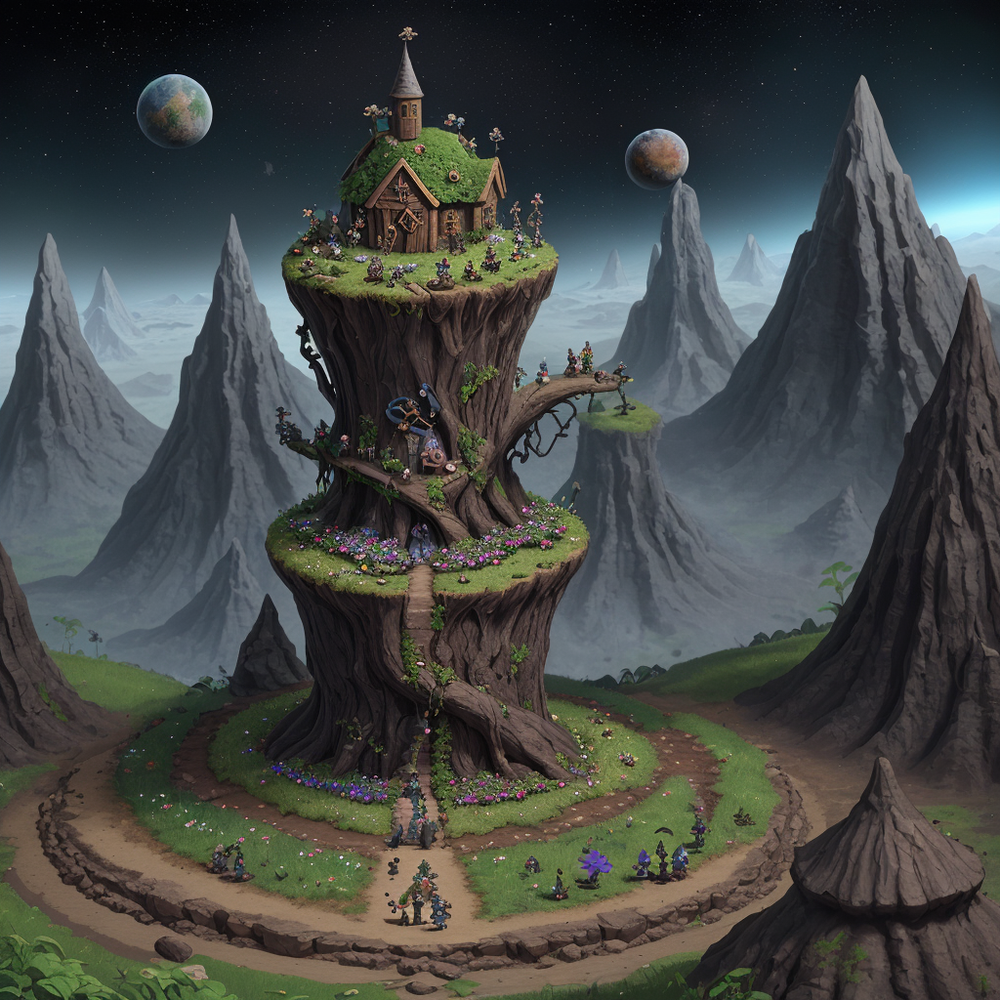

### 📷 1d503a8af1f71b949f2e172226631c54 

| Field          | Value                                                                                                                     |
|----------------|---------------------------------------------------------------------------------------------------------------------------|
| **Image ID**             | 1d503a8af1f71b949f2e172226631c54                                                                                                             |
| **Title**           | The Miracle of the Black Flower                                                                                                       |
| **Description**           | from a crack in the ground it is growing a black flower. there are multiple gnomes around it spiting on it so it can gain colors. in the background there are multiple gnomes and elfs praying to an entity overlooking to everyone from space                                                                                                        |
| **CreatedAt**        | 2024-12-21 17:49:38.133725                                                                                                        |
| **Model**        | dreamshaper                                                                                                        |
| **OpenAI**         | [OpenAI Image URL](http://192.168.1.85:8081/generated-images/b64642783850.png)                                                                                |
| **GitHub**         | [GitHub Image URL](https://raw.githubusercontent.com/Caneta-Silva/GODZ/refs/heads/main/images/1d503a8af1f71b949f2e172226631c54/1d503a8af1f71b949f2e172226631c54.jpg)                                                                                |
| **Tags**       | None                                                                                                                   |

### 📜 a62521ff9c29dc67b8f9c5e257417099

> from a crack in the ground it is growing a black flower. there are multiple gnomes around it spiting on it so it can gain colors. in the background there are multiple gnomes and elfs praying to an entity overlooking to everyone from space 

| Field          | Value                                                                                                                                                                      |
|----------------|----------------------------------------------------------------------------------------------------------------------------------------------------------------------------|
| **Prompt ID**  | a62521ff9c29dc67b8f9c5e257417099                                                                                                                                                            |
| **Prompt History** | <ul><li>**Input:**    **Output:**    **Type:** </li></ul> |
| **Created At** |                                                                                                                                                    |
| **Revised At** | None                                                                                                                                                   |
| **Revised Prompt** | No                                                                                                                                                                      |
| **Enhanced At** | None                                                                                                                                                  |
| **Enhanced Prompt** | No                                                                                                                                                                    |

| **Template**   |                                                                                                                                            |

