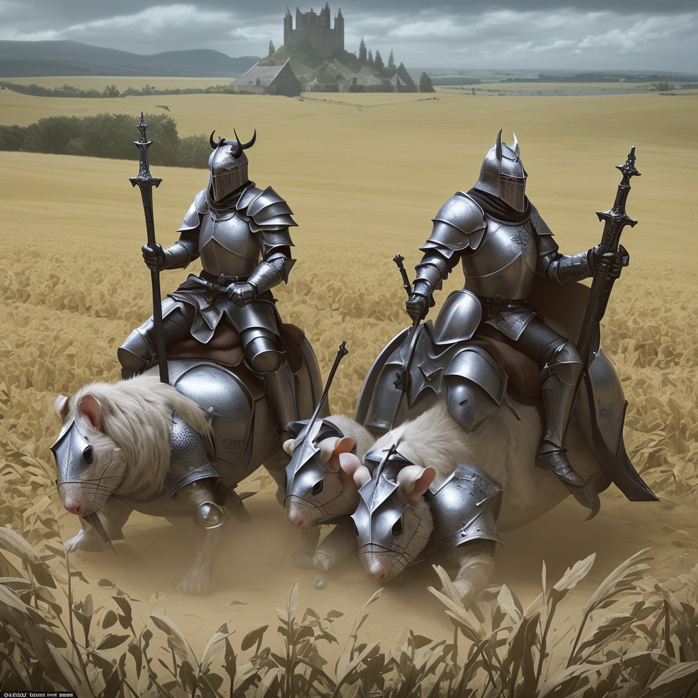

### 📷 312655a94e3dc311844a7ddf5af389da 

| Field          | Value                                                                                                                     |
|----------------|---------------------------------------------------------------------------------------------------------------------------|
| **Image ID**             | 312655a94e3dc311844a7ddf5af389da                                                                                                             |
| **Title**           | Defenders of the Holy Grail                                                                                                       |
| **Description**           | 3 knight templar mounted in a big hamsters (one of then full of sckars) defending the holy grail from a devil with 6 horns in a field with dead bodies                                                                                                       |
| **CreatedAt**        | 2024-12-21 16:56:07.250291                                                                                                        |
| **Model**        | dreamshaper                                                                                                        |
| **OpenAI**         | [OpenAI Image URL](http://192.168.1.85:8081/generated-images/b643334299269.png)                                                                                |
| **GitHub**         | [GitHub Image URL](https://raw.githubusercontent.com/Caneta-Silva/GODZ/refs/heads/main/images/312655a94e3dc311844a7ddf5af389da/312655a94e3dc311844a7ddf5af389da.jpg)                                                                                |
| **Tags**       | None                                                                                                                   |

### 📜 417bb24ccd58807e3a095e9934651b5e

> 3 knight templar mounted in a big hamsters (one of then full of sckars) defending the holy grail from a devil with 6 horns in a field with dead bodies

| Field          | Value                                                                                                                                                                      |
|----------------|----------------------------------------------------------------------------------------------------------------------------------------------------------------------------|
| **Prompt ID**  | 417bb24ccd58807e3a095e9934651b5e                                                                                                                                                            |
| **Prompt History** | <ul><li>**Input:**    **Output:**    **Type:** </li></ul> |
| **Created At** |                                                                                                                                                    |
| **Revised At** | None                                                                                                                                                   |
| **Revised Prompt** | No                                                                                                                                                                      |
| **Enhanced At** | None                                                                                                                                                  |
| **Enhanced Prompt** | No                                                                                                                                                                    |

| **Template**   |                                                                                                                                            |

