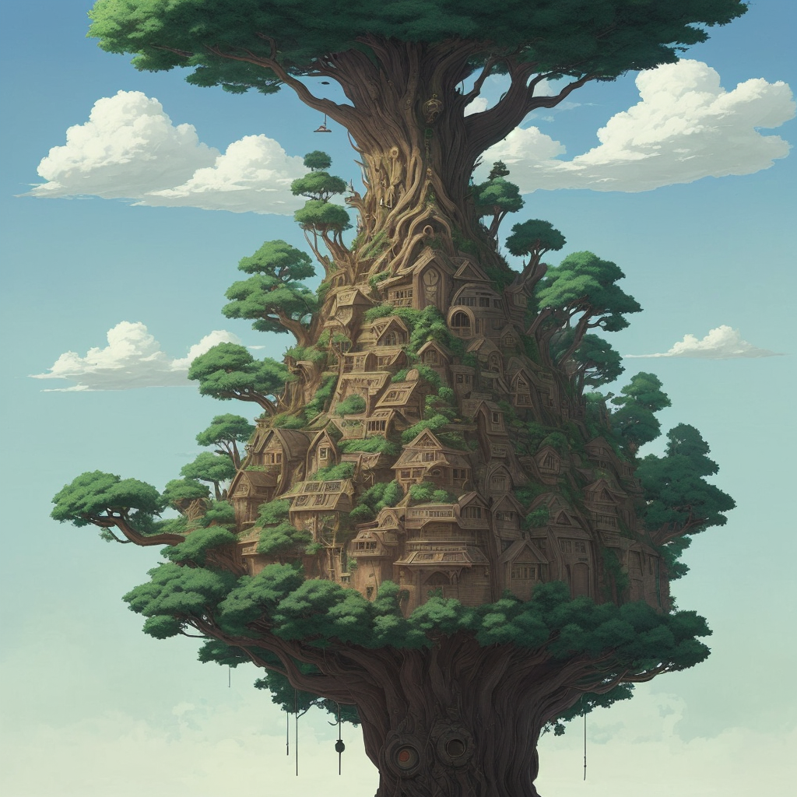

### 📷 86588a2d2870e101cf99935b54bcca5e 

| Field          | Value                                                                                                                     |
|----------------|---------------------------------------------------------------------------------------------------------------------------|
| **Image ID**             | 86588a2d2870e101cf99935b54bcca5e                                                                                                             |
| **Title**           | Divine Sentinel: The Ancients' Last Stand                                                                                                       |
| **Description**           | Almighty tree of God in a apocalyptic world in the style of studio Ghibli                                                                                                       |
| **CreatedAt**        | 2024-12-21 17:46:49.368929                                                                                                        |
| **Model**        | dreamshaper                                                                                                        |
| **OpenAI**         | [OpenAI Image URL](http://192.168.1.85:8081/generated-images/b64854255787.png)                                                                                |
| **GitHub**         | [GitHub Image URL](https://raw.githubusercontent.com/Caneta-Silva/GODZ/refs/heads/main/images/86588a2d2870e101cf99935b54bcca5e/86588a2d2870e101cf99935b54bcca5e.jpg)                                                                                |
| **Tags**       | None                                                                                                                   |

### 📜 25703b9c809e8555dbda19e49cc9ef39

> Almighty tree of God in a apocalyptic world in the style of studio Ghibli

| Field          | Value                                                                                                                                                                      |
|----------------|----------------------------------------------------------------------------------------------------------------------------------------------------------------------------|
| **Prompt ID**  | 25703b9c809e8555dbda19e49cc9ef39                                                                                                                                                            |
| **Prompt History** | <ul><li>**Input:**    **Output:**    **Type:** </li></ul> |
| **Created At** |                                                                                                                                                    |
| **Revised At** | None                                                                                                                                                   |
| **Revised Prompt** | No                                                                                                                                                                      |
| **Enhanced At** | None                                                                                                                                                  |
| **Enhanced Prompt** | No                                                                                                                                                                    |

| **Template**   |                                                                                                                                            |

