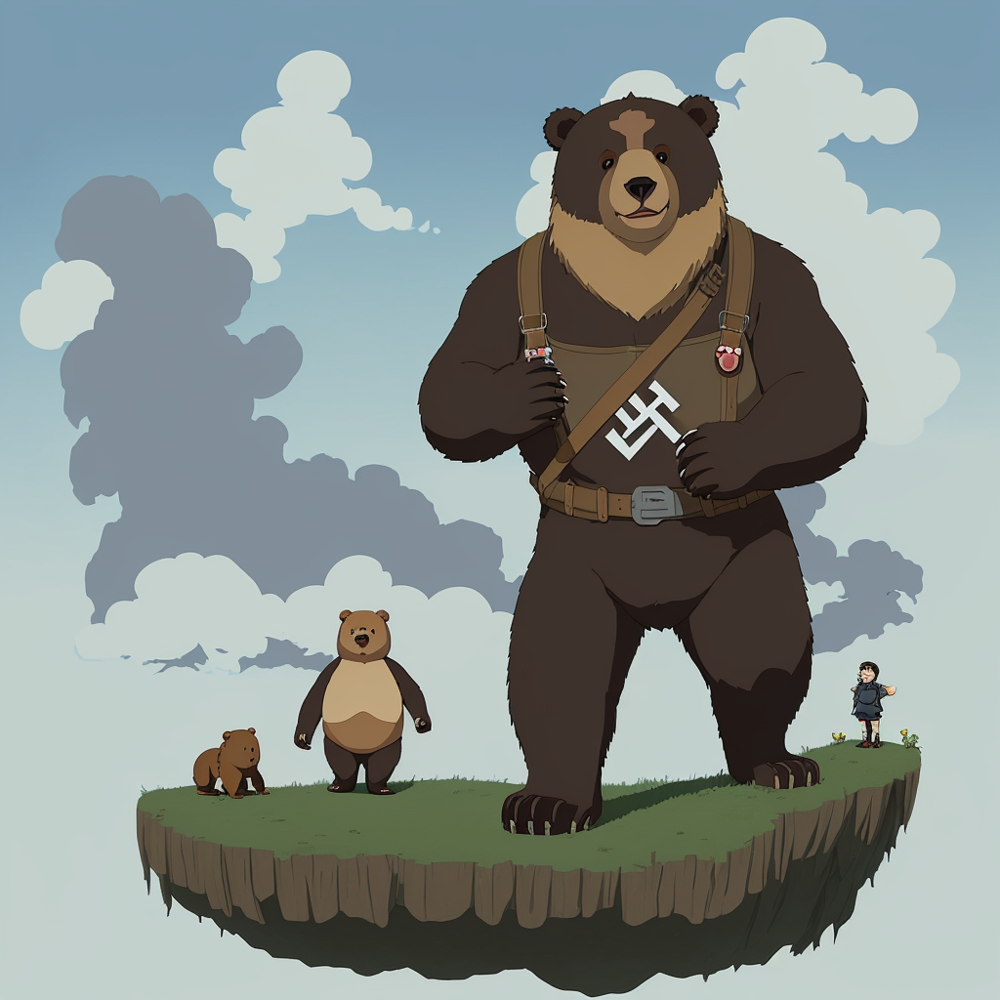

### 📷 9a41fcda2e9a0475daf3cfd49c310ece 

| Field          | Value                                                                                                                     |
|----------------|---------------------------------------------------------------------------------------------------------------------------|
| **Image ID**             | 9a41fcda2e9a0475daf3cfd49c310ece                                                                                                             |
| **Title**           | Ethereal Encounter: The Enchanted Nazi Bear                                                                                                       |
| **Description**           | nazi bear in the style of studio Ghibli                                                                                                       |
| **CreatedAt**        | 2024-12-21 16:46:47.824687                                                                                                        |
| **Model**        | dreamshaper                                                                                                        |
| **OpenAI**         | [OpenAI Image URL](http://192.168.1.85:8081/generated-images/b641204192846.png)                                                                                |
| **GitHub**         | [GitHub Image URL](https://raw.githubusercontent.com/Caneta-Silva/GODZ/refs/heads/main/images/9a41fcda2e9a0475daf3cfd49c310ece/9a41fcda2e9a0475daf3cfd49c310ece.jpg)                                                                                |
| **Tags**       | None                                                                                                                   |

### 📜 1b601f32cdbfa096f71b09bdb1c7fbcd

> nazi bear in the style of studio Ghibli

| Field          | Value                                                                                                                                                                      |
|----------------|----------------------------------------------------------------------------------------------------------------------------------------------------------------------------|
| **Prompt ID**  | 1b601f32cdbfa096f71b09bdb1c7fbcd                                                                                                                                                            |
| **Prompt History** | <ul><li>**Input:**    **Output:**    **Type:** </li></ul> |
| **Created At** |                                                                                                                                                    |
| **Revised At** | None                                                                                                                                                   |
| **Revised Prompt** | No                                                                                                                                                                      |
| **Enhanced At** | None                                                                                                                                                  |
| **Enhanced Prompt** | No                                                                                                                                                                    |

| **Template**   |                                                                                                                                            |

