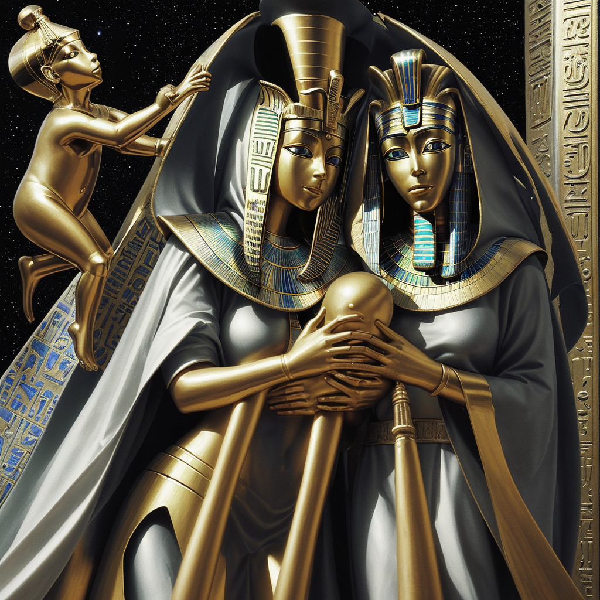

### 📷 a3efb2b04c74b97d58cc8d932d23b9bb 

| Field          | Value                                                                                                                     |
|----------------|---------------------------------------------------------------------------------------------------------------------------|
| **Image ID**             | a3efb2b04c74b97d58cc8d932d23b9bb                                                                                                             |
| **Title**           | Hermetic Frequency                                                                                                       |
| **Description**           | hermetic frequency of the egyptians meeting the family of god encompassing the entire oneness of the universe                                                                                                       |
| **CreatedAt**        | 2024-12-21 17:41:20.371913                                                                                                        |
| **Model**        | dreamshaper                                                                                                        |
| **OpenAI**         | [OpenAI Image URL](http://192.168.1.85:8081/generated-images/b641267590815.png)                                                                                |
| **GitHub**         | [GitHub Image URL](https://raw.githubusercontent.com/Caneta-Silva/GODZ/refs/heads/main/images/a3efb2b04c74b97d58cc8d932d23b9bb/a3efb2b04c74b97d58cc8d932d23b9bb.jpg)                                                                                |
| **Tags**       | None                                                                                                                   |

### 📜 10027477d842c3f2f7844bbff192a150

> hermetic frequency of the egyptians meeting the family of god encompassing the entire oneness of the universe

| Field          | Value                                                                                                                                                                      |
|----------------|----------------------------------------------------------------------------------------------------------------------------------------------------------------------------|
| **Prompt ID**  | 10027477d842c3f2f7844bbff192a150                                                                                                                                                            |
| **Prompt History** | <ul><li>**Input:**    **Output:**    **Type:** </li></ul> |
| **Created At** |                                                                                                                                                    |
| **Revised At** | None                                                                                                                                                   |
| **Revised Prompt** | No                                                                                                                                                                      |
| **Enhanced At** | None                                                                                                                                                  |
| **Enhanced Prompt** | No                                                                                                                                                                    |

| **Template**   |                                                                                                                                            |

