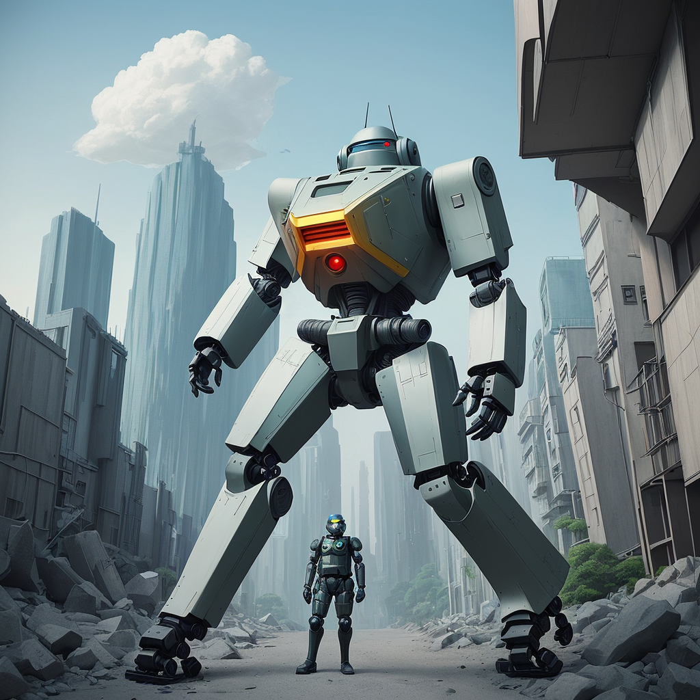

### 📷 a9de254b92de277bd48a373cfbad5d0c 

| Field          | Value                                                                                                                     |
|----------------|---------------------------------------------------------------------------------------------------------------------------|
| **Image ID**             | a9de254b92de277bd48a373cfbad5d0c                                                                                                             |
| **Title**           | Futuristic Riot Police Robot in the Style of Studio Ghibli                                                                                                       |
| **Description**           | Create a landscape full body image of a futuristic riot police robot in the style of Studio Ghibli                                                                                                       |
| **CreatedAt**        | 2024-12-21 02:02:09.620964                                                                                                        |
| **Model**        | dreamshaper                                                                                                        |
| **OpenAI**         | [OpenAI Image URL](http://192.168.1.85:8081/generated-images/b641523980783.png)                                                                                |
| **GitHub**         | [GitHub Image URL](https://raw.githubusercontent.com/Caneta-Silva/GODZ/refs/heads/main/images/a9de254b92de277bd48a373cfbad5d0c/a9de254b92de277bd48a373cfbad5d0c.jpg)                                                                                |
| **Tags**       | None                                                                                                                   |

### 📜 1e98df99266401f57f37dea6d0515e92

> Create a landscape full body image of a futuristic riot police robot in the style of Studio Ghibli

| Field          | Value                                                                                                                                                                      |
|----------------|----------------------------------------------------------------------------------------------------------------------------------------------------------------------------|
| **Prompt ID**  | 1e98df99266401f57f37dea6d0515e92                                                                                                                                                            |
| **Prompt History** | <ul><li>**Input:**    **Output:**    **Type:** </li></ul> |
| **Created At** |                                                                                                                                                    |
| **Revised At** | None                                                                                                                                                   |
| **Revised Prompt** | No                                                                                                                                                                      |
| **Enhanced At** | None                                                                                                                                                  |
| **Enhanced Prompt** | No                                                                                                                                                                    |

| **Template**   | Create a {{ aspect_ratio }} {{ modifiers.image }} image of a {{ modifiers.element }} {{ element }} in the style of {{ style }}                                                                                                                                           |

