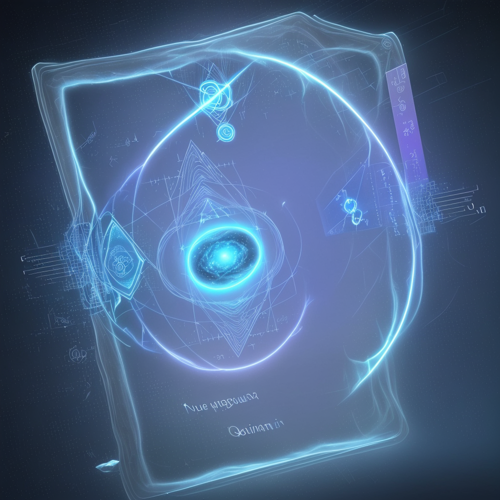

### 📷 b751c6e2fa7c0e9f081652a9dc4b4c2d 

| Field          | Value                                                                                                                     |
|----------------|---------------------------------------------------------------------------------------------------------------------------|
| **Image ID**             | b751c6e2fa7c0e9f081652a9dc4b4c2d                                                                                                             |
| **Title**           | Transmutation of Quantum Cloud into Pure Consciousness                                                                                                       |
| **Description**           | the quantum cloud present in the moment, transmuting from the 3D reality into pure consciousness and seeing all                                                                                                       |
| **CreatedAt**        | 2024-12-21 18:10:01.256622                                                                                                        |
| **Model**        | dreamshaper                                                                                                        |
| **OpenAI**         | [OpenAI Image URL](http://192.168.1.85:8081/generated-images/b642477037278.png)                                                                                |
| **GitHub**         | [GitHub Image URL](https://raw.githubusercontent.com/Caneta-Silva/GODZ/refs/heads/main/images/b751c6e2fa7c0e9f081652a9dc4b4c2d/b751c6e2fa7c0e9f081652a9dc4b4c2d.jpg)                                                                                |
| **Tags**       | None                                                                                                                   |

### 📜 144d95f387ce9ae0c3d9aaaaa9e01eaa

> the quantum cloud present in the moment, transmuting from the 3D reality into pure consciousness and seeing all

| Field          | Value                                                                                                                                                                      |
|----------------|----------------------------------------------------------------------------------------------------------------------------------------------------------------------------|
| **Prompt ID**  | 144d95f387ce9ae0c3d9aaaaa9e01eaa                                                                                                                                                            |
| **Prompt History** | <ul><li>**Input:**    **Output:**    **Type:** </li></ul> |
| **Created At** |                                                                                                                                                    |
| **Revised At** | None                                                                                                                                                   |
| **Revised Prompt** | No                                                                                                                                                                      |
| **Enhanced At** | None                                                                                                                                                  |
| **Enhanced Prompt** | No                                                                                                                                                                    |

| **Template**   |                                                                                                                                            |

