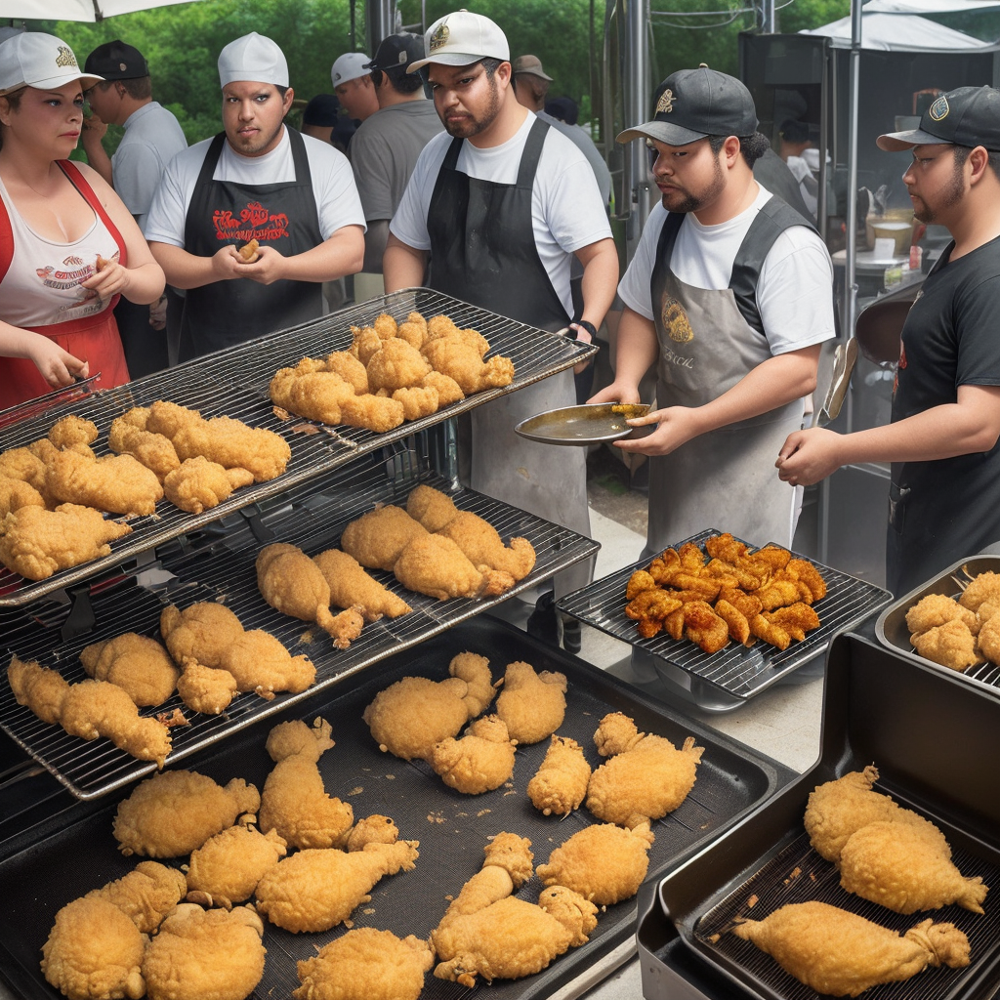

### 📷 c08da4f518280e05c39c1d7996156430 

| Field          | Value                                                                                                                     |
|----------------|---------------------------------------------------------------------------------------------------------------------------|
| **Image ID**             | c08da4f518280e05c39c1d7996156430                                                                                                             |
| **Title**           | The King of Frying Chicken                                                                                                       |
| **Description**           | the king of frying chicken is so good that there is a line of people to buy it, and a line of chickens getting ready to go to the grill                                                                                                       |
| **CreatedAt**        | 2024-12-21 19:32:54.668233                                                                                                        |
| **Model**        | dreamshaper                                                                                                        |
| **OpenAI**         | [OpenAI Image URL](http://192.168.1.85:8081/generated-images/b641174563700.png)                                                                                |
| **GitHub**         | [GitHub Image URL](https://raw.githubusercontent.com/Caneta-Silva/GODZ/refs/heads/main/images/c08da4f518280e05c39c1d7996156430/c08da4f518280e05c39c1d7996156430.jpg)                                                                                |
| **Tags**       | None                                                                                                                   |

### 📜 b6b50cd9cc57df42101d623149c7fcdc

> the king of frying chicken is so good that there is a line of people to buy it, and a line of chickens getting ready to go to the grill

| Field          | Value                                                                                                                                                                      |
|----------------|----------------------------------------------------------------------------------------------------------------------------------------------------------------------------|
| **Prompt ID**  | b6b50cd9cc57df42101d623149c7fcdc                                                                                                                                                            |
| **Prompt History** | <ul><li>**Input:**    **Output:**    **Type:** </li></ul> |
| **Created At** |                                                                                                                                                    |
| **Revised At** | None                                                                                                                                                   |
| **Revised Prompt** | No                                                                                                                                                                      |
| **Enhanced At** | None                                                                                                                                                  |
| **Enhanced Prompt** | No                                                                                                                                                                    |

| **Template**   |                                                                                                                                            |

