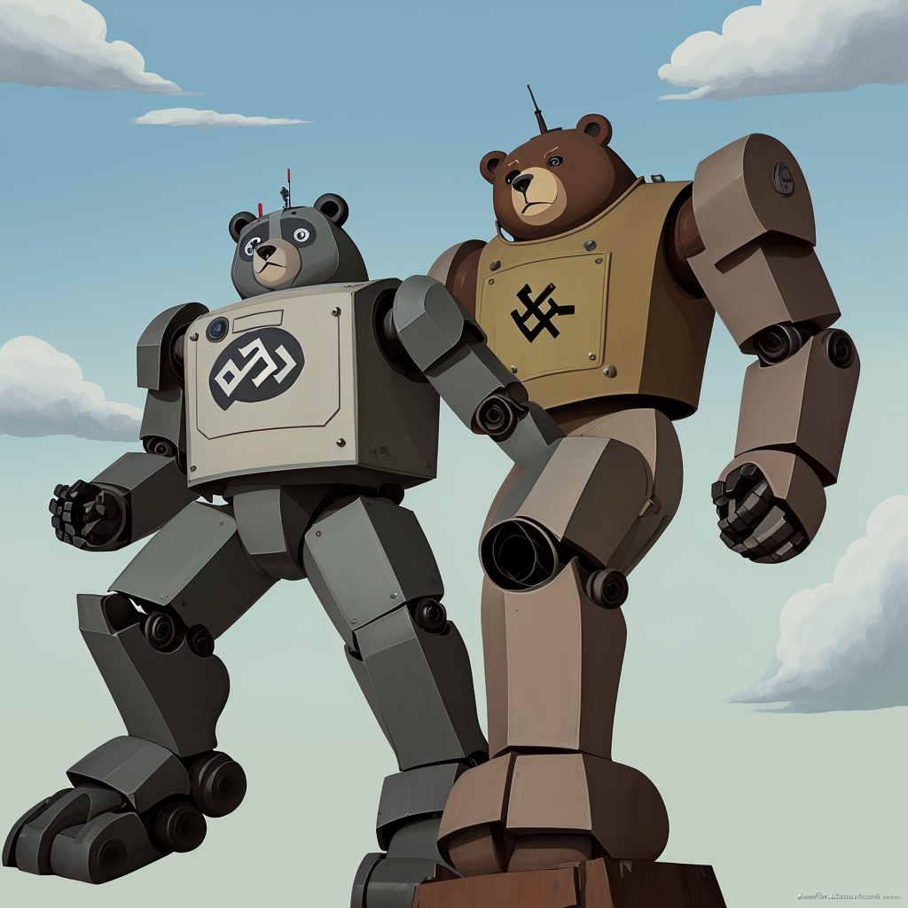

### 📷 e0e105bfa0eabfd149462d094af3dcfc 

| Field          | Value                                                                                                                     |
|----------------|---------------------------------------------------------------------------------------------------------------------------|
| **Image ID**             | e0e105bfa0eabfd149462d094af3dcfc                                                                                                             |
| **Title**           | Mechanical Behemoth: A Ghibli-Inspired Integration of Nazi Bear and Robot                                                                                                       |
| **Description**           | nazi bear robot in the style of studio Ghibli                                                                                                       |
| **CreatedAt**        | 2024-12-21 16:43:26.036226                                                                                                        |
| **Model**        | dreamshaper                                                                                                        |
| **OpenAI**         | [OpenAI Image URL](http://192.168.1.85:8081/generated-images/b642388668766.png)                                                                                |
| **GitHub**         | [GitHub Image URL](https://raw.githubusercontent.com/Caneta-Silva/GODZ/refs/heads/main/images/e0e105bfa0eabfd149462d094af3dcfc/e0e105bfa0eabfd149462d094af3dcfc.jpg)                                                                                |
| **Tags**       | None                                                                                                                   |

### 📜 255b6c6dc907aaf8504b61f4ab89b3f4

> nazi bear robot in the style of studio Ghibli

| Field          | Value                                                                                                                                                                      |
|----------------|----------------------------------------------------------------------------------------------------------------------------------------------------------------------------|
| **Prompt ID**  | 255b6c6dc907aaf8504b61f4ab89b3f4                                                                                                                                                            |
| **Prompt History** | <ul><li>**Input:**    **Output:**    **Type:** </li></ul> |
| **Created At** |                                                                                                                                                    |
| **Revised At** | None                                                                                                                                                   |
| **Revised Prompt** | No                                                                                                                                                                      |
| **Enhanced At** | None                                                                                                                                                  |
| **Enhanced Prompt** | No                                                                                                                                                                    |

| **Template**   |                                                                                                                                            |

