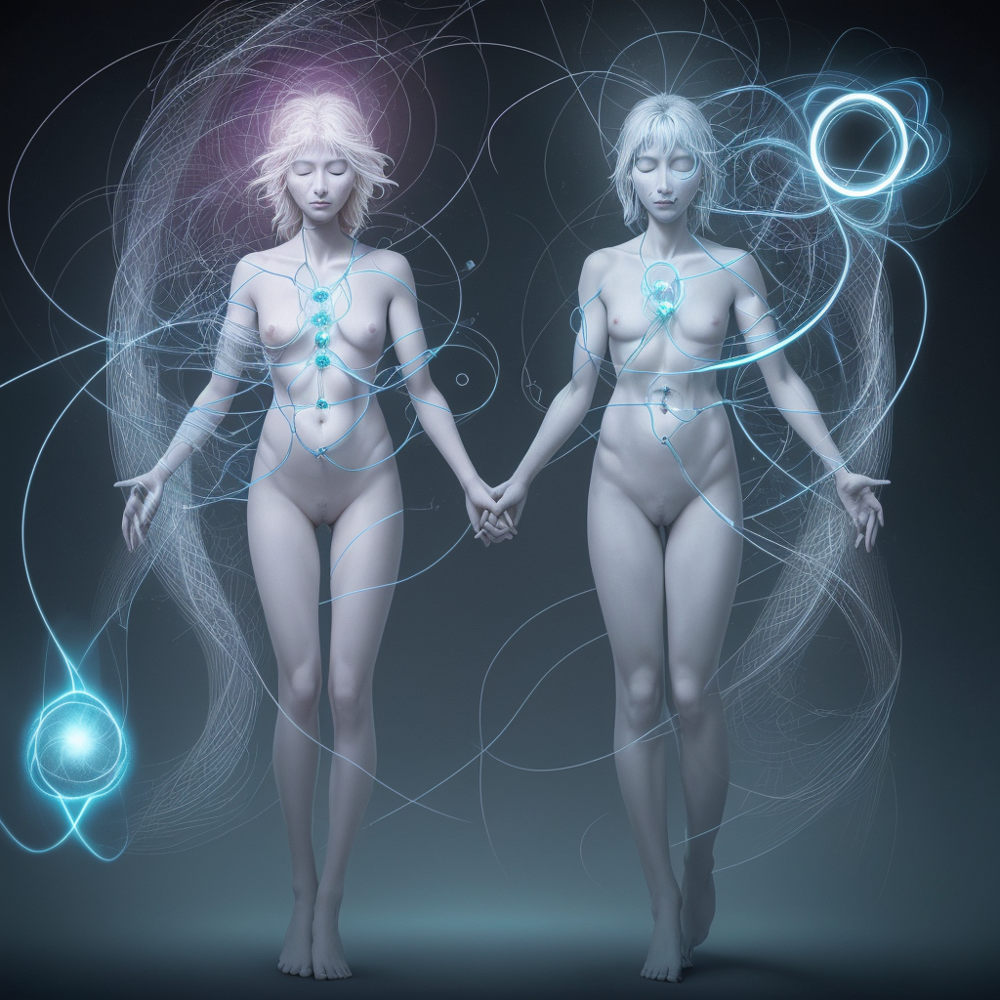

### 📷 f5abe1f13670e4501ec352662733badc 

| Field          | Value                                                                                                                     |
|----------------|---------------------------------------------------------------------------------------------------------------------------|
| **Image ID**             | f5abe1f13670e4501ec352662733badc                                                                                                             |
| **Title**           | Entangled Unity: Mind, Body, Spirit, Reality                                                                                                       |
| **Description**           | the communication of quantum entanglement with the unity of the mind body spirit and, therefore, the resulting reality                                                                                                       |
| **CreatedAt**        | 2024-12-21 17:58:25.828138                                                                                                        |
| **Model**        | dreamshaper                                                                                                        |
| **OpenAI**         | [OpenAI Image URL](http://192.168.1.85:8081/generated-images/b64134474128.png)                                                                                |
| **GitHub**         | [GitHub Image URL](https://raw.githubusercontent.com/Caneta-Silva/GODZ/refs/heads/main/images/f5abe1f13670e4501ec352662733badc/f5abe1f13670e4501ec352662733badc.jpg)                                                                                |
| **Tags**       | None                                                                                                                   |

### 📜 2d51e68b2f6b22ad3dfa144fa3d03e30

> the communication of quantum entanglement with the unity of the mind body spirit and, therefore, the resulting reality

| Field          | Value                                                                                                                                                                      |
|----------------|----------------------------------------------------------------------------------------------------------------------------------------------------------------------------|
| **Prompt ID**  | 2d51e68b2f6b22ad3dfa144fa3d03e30                                                                                                                                                            |
| **Prompt History** | <ul><li>**Input:**    **Output:**    **Type:** </li></ul> |
| **Created At** |                                                                                                                                                    |
| **Revised At** | None                                                                                                                                                   |
| **Revised Prompt** | No                                                                                                                                                                      |
| **Enhanced At** | None                                                                                                                                                  |
| **Enhanced Prompt** | No                                                                                                                                                                    |

| **Template**   |                                                                                                                                            |

